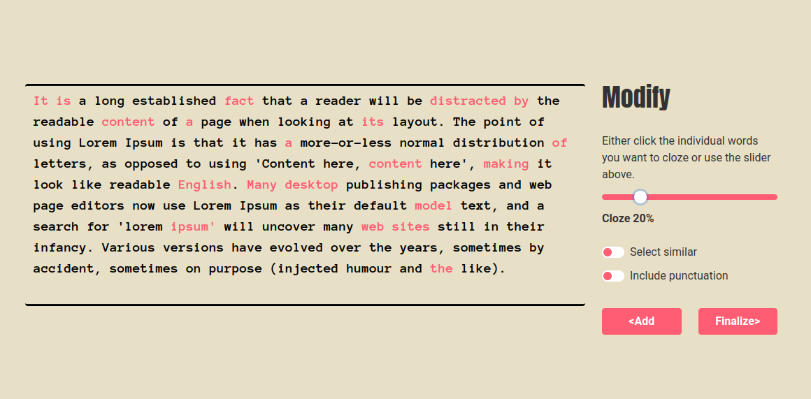

# Fillitin

This is a Svelte web app use to create cloze sentences from text. You can find the demo of it at [https://fillitin.pages.dev/](https://fillitin.pages.dev/).



## To use

If you'd like to run this locally, you can do the following:

```bash
git clone https://github.com/kilroyjones/fillitin/
cd fillitin
npm install
npm run dev
```

The server should be running on [http://localhost:5000](http://localhost:5000).

## License

Licensed under either of

- MIT license ([LICENSE-MIT](LICENSE-MIT) or http://opensource.org/licenses/MIT)

at your option.
